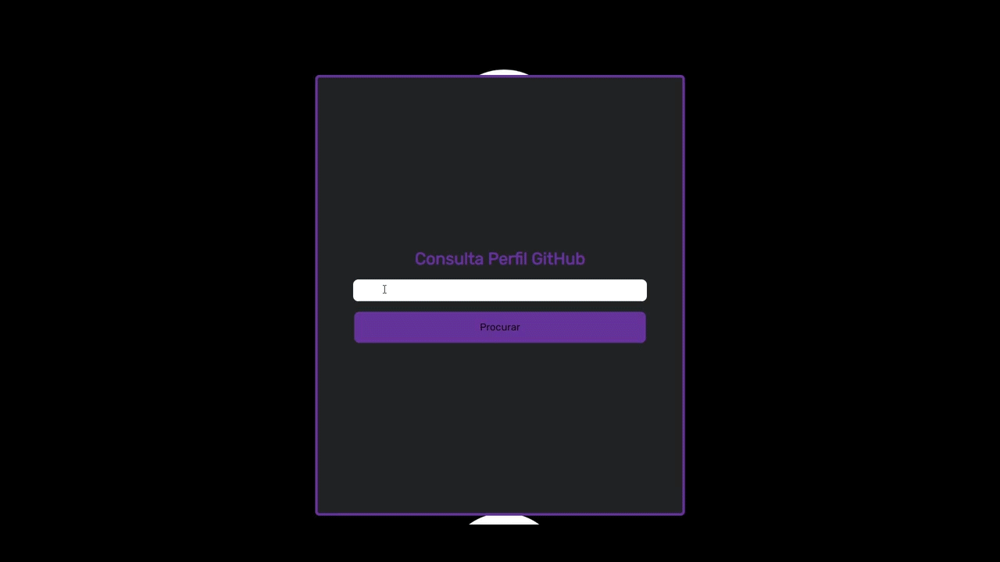

<h1 align="center">
   💻 <a href="#"> Consulta GitHub API </a>
    
   </img>
</h1>

<h3 align="center">
    Projeto que consome a API do Github
</h3>

 <a href="#sobre">Sobre</a> •
 <a href="#como-usar">Como usar</a> •
 <a href="#feito-com">Feito com</a> • 
 <a href="#autor">Autor</a> 

## Sobre

Projeto desenvolvido por mim com o intuito de exercitar conhecimentos em HTML, CSS e JavaScript. E também para testar requisições simples usando o AJAX do Jquery.

 

## Como usar

Após acessar a página digite o nome de usuário a ser pesquisado no campo de texto

Para acessar o link da página <a href="https://lucasmsf.github.io/ConsultaGitHubAPI/">Clique aqui</a>

## Feito com

    
    
    

## Autor

<a href="https://github.com/lucasMSF">
 
  
 <b>Lucas Mathias</b></a> 
  

